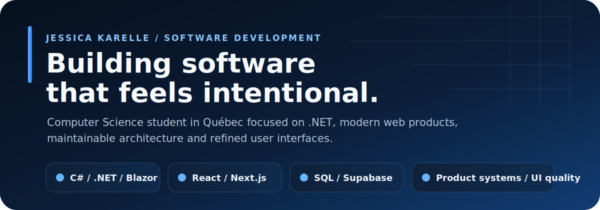
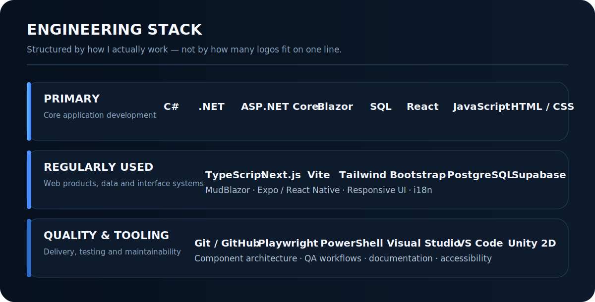
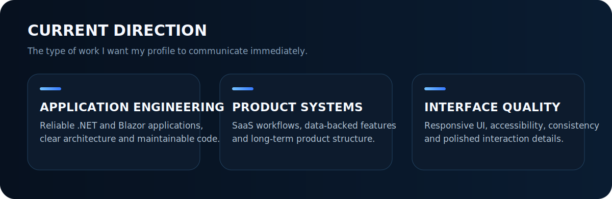

  

  <a href="https://jessicakarelle.com"><strong>WEBSITE</strong></a>
  &nbsp;&nbsp;/&nbsp;&nbsp;
  <a href="https://portfolio.jessicakarelle.com"><strong>PORTFOLIO</strong></a>
  &nbsp;&nbsp;/&nbsp;&nbsp;
  <a href="https://github.com/jessicakarelle?tab=repositories"><strong>REPOSITORIES</strong></a>
  &nbsp;&nbsp;/&nbsp;&nbsp;
  <a href="https://linkedin.com/in/jessicakarelle"><strong>LINKEDIN</strong></a>
  &nbsp;&nbsp;/&nbsp;&nbsp;
  <a href="mailto:jessica@jessicakarelle.com"><strong>EMAIL</strong></a>

 

## Profile

I am a Computer Science student at **Cégep Saint-Jean-sur-Richelieu** and a software developer focused on building structured, maintainable and product-oriented applications.

My work combines **application engineering**, **modern web development**, **interface quality** and **long-term technical thinking**. I care about the details that make software dependable: architecture, consistency, accessibility, documentation, testing and clear user flows.

  

  

## Selected work

### Professional software development

Experience contributing to a real-world **.NET and Blazor** application, including interface modernization, responsive dashboards, component refinement, quality assurance workflows and maintainability improvements.

### Product and SaaS development

Development of ambitious web and application projects using **React, Next.js, TypeScript, Supabase and PostgreSQL**, with attention to multilingual content, authentication, responsive interfaces and scalable product structure.

### Personal technology initiatives

Independent work around productivity, education, intelligent systems and human-centered technology, supported by a strong interest in product direction, software quality and long-term ecosystem design.

## Principles

`Maintainability` `Clear architecture` `Responsive interfaces` `Accessibility` `Product thinking` `Testing` `Documentation` `Long-term quality`

## Contact

- Website: [jessicakarelle.com](https://jessicakarelle.com)
- Portfolio: [portfolio.jessicakarelle.com](https://portfolio.jessicakarelle.com)
- LinkedIn: [linkedin.com/in/jessicakarelle](https://linkedin.com/in/jessicakarelle)
- Email: [jessica@jessicakarelle.com](mailto:jessica@jessicakarelle.com)
